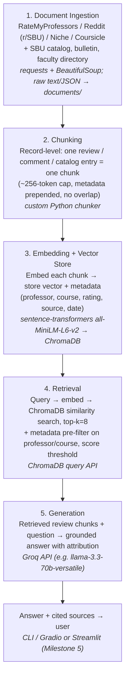

# Project 1 Planning: The Unofficial Guide

> Write this document before you write any pipeline code.
> Your spec and architecture diagram are what you'll use to direct AI tools (Claude, Copilot, etc.) to generate your implementation — the more specific they are, the more useful the generated code will be.
> Update the Retrieval Approach and Chunking Strategy sections if you change your approach during implementation.
> Update this file before starting any stretch features.

---

## Domain

<!-- What domain did you choose? Why is this knowledge valuable and hard to find through official channels? -->

**Domain:** Student reviews and experiences with Computer Science (CSE) professors at Stony Brook University (SBU).

**What it covers:** Crowd-sourced student opinions on individual CSE professors — teaching style, clarity of lectures, grading difficulty, workload, exam fairness, attendance/participation policies, helpfulness during office hours, and whether a course is worth taking with a specific instructor. It spans introductory courses (e.g., CSE 101/114/214) through upper-division and graduate courses, and captures how the *same* course can differ dramatically depending on who teaches it.

**Why this knowledge is valuable:** Course registration at SBU is a high-stakes, time-boxed event. The official course catalog and the registrar list *what* a course is and *who* teaches it, but say nothing about *what it's actually like* to take it with a given professor. Picking the right instructor can be the difference between a manageable semester and a punishing one, yet the only reliable signal comes from other students who have already taken the class.

**Why it's hard to find through official channels:** SBU does not publish its internal course evaluations to students, and even when partial data exists it's quantitative (star ratings) without the qualitative "here's what to expect" detail students actually need. The useful knowledge is scattered across review sites, Reddit threads, Discord servers, and word-of-mouth — unstructured, anonymous, inconsistently formatted, and never aggregated in one searchable place. A RAG system is a natural fit: it can pull the relevant student voices for a specific professor or course and synthesize them into a direct answer.

---

## Documents

<!-- List your specific sources: URLs, subreddit names, forum threads, or file descriptions.
     Aim for at least 10 sources that together cover different subtopics or perspectives within your domain. -->

| # | Source | Description | URL or location |
|---|--------|-------------|-----------------|
| 1 | RateMyProfessors — SBU CSE department page | Lists all rated CSE professors with star ratings, "would take again" %, difficulty scores, and free-text student reviews. Primary source of per-professor qualitative reviews. | https://www.ratemyprofessors.com/search/professors/971?q=* (filter to Computer Science) |
| 2 | RateMyProfessors — individual professor pages | Full review threads for high-volume CSE instructors (e.g., long-time intro-course professors). Each page = one professor, many tagged reviews. | Individual profile URLs linked from source #1 |
| 3 | r/SBU subreddit — professor/course recommendation threads | Reddit threads where students ask "who should I take for CSE 214?" and get detailed candid answers. Different perspective and tone than RMP. | https://www.reddit.com/r/SBU/ (search: "CSE professor", "best professor for") |
| 4 | r/SBU subreddit — "which professor" megathreads & registration advice | Recurring registration-season threads aggregating advice across many courses and professors. | https://www.reddit.com/r/SBU/search/?q=professor%20recommendation |
| 5 | SBU CSE official course catalog | Authoritative course descriptions, prerequisites, and credit info. Used for grounding/attribution and to map professors to courses, not for opinions. | https://www.cs.stonybrook.edu/students/Undergraduate-Studies/courses |
| 6 | SBU undergraduate bulletin — CSE listings | Official course numbers, titles, and descriptions to normalize course references found in reviews. | https://www.stonybrook.edu/sb/bulletin/current/academicprograms/cse/ |
| 7 | SBU CSE faculty directory | Maps professor names to research areas and the courses they typically teach; helps disambiguate names in reviews. | https://www.cs.stonybrook.edu/people/faculty |
| 8 | Reddit r/StonyBrook (alt community) | Secondary SBU community with additional course/professor discussion and exam-difficulty threads. | https://www.reddit.com/r/StonyBrook/ |
| 9 | Course Hero / coursicle professor pages for SBU | Aggregated schedules and additional student ratings/comments for SBU CSE instructors. | https://www.coursicle.com/stonybrook/professors/ |
| 10 | Niche.com — Stony Brook University reviews | Public student-written reviews of SBU academics and professors, including comments on course difficulty and teaching quality that complement RMP and Reddit. | https://www.niche.com/colleges/stony-brook-university/reviews/ |

---

## Chunking Strategy

<!-- How will you split documents into chunks?
     State your chunk size (in tokens or characters), overlap size, and explain why those
     numbers fit the structure of your documents.
     A review-heavy corpus warrants different chunking than a long FAQ. -->

**Chunk size:** ~256 tokens (cap), but the *primary* boundary is one review / one comment / one course-catalog entry = one chunk. Most RateMyProfessors and Reddit reviews are 1–4 sentences and fall well under this cap; the token limit only kicks in to split unusually long Reddit posts.

**Overlap:** 0 (none) for review-level chunks. A small ~40-token overlap is applied *only* when a single long Reddit post has to be split across multiple chunks.

**Reasoning:**

The corpus is **review-heavy and record-structured**, not long-form prose. The two natural failure modes for this domain are (1) splitting one review's verdict across a chunk boundary, and (2) merging reviews about *different professors* into one chunk. Both corrupt attribution — which is the whole point of this system ("what do students say about Professor X?"). A fixed-size sliding-window chunker (the usual default, e.g. 512 tokens / 50 overlap) optimizes for neither: it would routinely glue the tail of one professor's review onto the head of another's, so a query about Professor A could retrieve a chunk that's half about Professor B. Overlap makes this *worse* here, because the bleed-over text is from a semantically unrelated, differently-attributed review.

So the strategy is **record-level chunking**: treat each review/comment as an atomic, self-contained unit and emit it as one chunk, with its metadata (professor name, course number, rating/difficulty, source, date) prepended to the chunk text. This keeps each chunk single-professor and single-opinion, which makes attribution clean and lets retrieval pull *many independent* opinions rather than a few contaminated blobs. Reviews are already short and independent, so overlap buys nothing — it's only used as a fallback inside an over-long post, where context genuinely does carry across the split.

The official sources (catalog, bulletin, faculty directory — #5–7) are also naturally record-structured (one course / one faculty entry per chunk), so the same one-record-one-chunk rule applies to them.

---

## Retrieval Approach

<!-- Which embedding model are you using (e.g., all-MiniLM-L6-v2 via sentence-transformers)?
     How many chunks will you retrieve per query (top-k)?
     If you were deploying this for real users and cost wasn't a constraint, what tradeoffs
     would you weigh in choosing a different embedding model — context length, multilingual
     support, accuracy on domain-specific text, latency? -->

**Embedding model:** `all-MiniLM-L6-v2` via `sentence-transformers` (384-dim, ~256-token input window). Runs locally, free, fast, and the small input window is a near-perfect match for our small review-level chunks — no chunk gets truncated by the encoder.

**Top-k:** 8 (with a metadata pre-filter on professor/course where the query names one — see below).

**Reasoning for top-k:** Unlike a FAQ or manual, where a single correct chunk answers the question (k=3 is plenty), the answer here is a *synthesis of many short, anecdotal opinions*. One review is noise; a fair verdict on a professor only emerges by aggregating several independent reviews and letting consensus and disagreement show through. A higher k (8) gathers enough voices to average out one-off rants or raves. Going much higher than ~8–10 starts pulling in lower-similarity, off-target reviews (and, for sparsely-reviewed professors, reviews about *other* professors), so 8 balances coverage against contamination.

**Production tradeoff reflection:**

If this were a real product and cost weren't a constraint, the choices I'd revisit:

- **Hybrid retrieval over pure semantic.** Professor names and course numbers are exact-match keys, but embeddings treat "Professor Chen" and "Professor Chang" as near-neighbors and can happily return the wrong professor's reviews when their text is similar. The biggest accuracy win wouldn't come from a bigger embedding model — it'd come from a **metadata filter** (restrict to the named professor/course *before* semantic ranking) combined with a keyword/BM25 pass for exact name matching. That structurally eliminates the misattribution failure mode that a larger embedding model only mitigates probabilistically.
- **A stronger embedding model** (e.g. `bge-large-en`, `gte-large`, or a hosted `voyage-3`/OpenAI `text-embedding-3-large`) for better discrimination on short, slangy, domain-specific student text. The accuracy gain is real but secondary to the hybrid-retrieval point above.
- **Context length** is *not* a reason to switch here — chunks are tiny, so MiniLM's 256-token window is a feature (fast, cheap), not a limitation. I'd only need a long-context encoder if I moved to embedding whole Reddit threads as single chunks, which the chunking strategy deliberately avoids.
- **Multilingual** support is unnecessary — the corpus is English-only.
- The remaining axis is **latency vs. accuracy**: a hosted large model adds network latency and per-call cost per query; for an interactive "who should I take?" tool, MiniLM running locally keeps retrieval sub-100ms, which matters more for UX than a marginal recall bump.

---

## Evaluation Plan

<!-- List your 5 test questions with their expected correct answers.
     Questions should be specific enough that you can judge whether the system's response
     is right or wrong. "What are good dining halls?" is too vague.
     "What do students say about wait times at [dining hall name] during lunch?" is testable. -->

> Note: the exact professor names below are placeholders to be locked in *after* collection (Milestone 1), once I see which CSE instructors actually have enough reviews to test against. Course numbers are real SBU CSE courses. Expected answers describe what a correct synthesis should contain; judge the system's response against the consensus actually present in the collected reviews, not against these summaries verbatim.

| # | Question | Expected answer |
|---|----------|-----------------|
| 1 | What do students say about the grading difficulty of CSE 214 (Data Structures) with [Professor A]? | Synthesis should reflect the dominant sentiment in the reviews — e.g. "consistently described as a tough/strict grader with a heavy workload, but exams are considered fair if you keep up with the homework." Should cite multiple reviews, not one. |
| 2 | Is [Professor B] a good choice for CSE 114 (Intro to OOP) if I'm new to programming? | Should aggregate beginner-relevant comments: lecture clarity, pace, helpfulness in office hours, and whether reviewers recommend them for a first programming course — with a recommend / don't-recommend lean if the reviews show one. |
| 3 | How do students describe [Professor C]'s lecture style and exams in CSE 220 (Systems Fundamentals)? | Should summarize recurring descriptors of lecture style (e.g. fast vs. clear, slide-reader vs. engaging) and exam character (cumulative, conceptual vs. coding, difficulty), grounded in several reviews. |
| 4 | Between [Professor A] and [Professor D], who do students prefer for CSE 214, and why? | A comparative answer drawing on reviews for *both*: which has the higher "would take again" / clearer teaching / fairer grading per the corpus, with the stated reasons. Must not invent a preference the reviews don't support. |
| 5 | Do students think attendance and participation matter in [Professor E]'s CSE 101 class? | Should report whether reviews mention mandatory attendance, participation/clicker points, or penalties — and say so explicitly if the reviews are silent or mixed on this (rather than fabricating a policy). |

---

## Anticipated Challenges

<!-- What could go wrong? Name at least two specific risks with reasoning.
     Consider: noisy or inconsistent documents, missing source attribution, off-topic
     retrieval, chunks that split key information across boundaries. -->

1. **Misattribution / cross-professor contamination.** Many CSE professors share courses, and some have similar names (or are referred to by nicknames, last-name-only, or misspellings). Pure semantic retrieval can return reviews about the *wrong* professor when the review text is similar, and a query about Professor A could surface a chunk whose sentiment actually belongs to Professor B. This is the most damaging failure for this domain because the entire value proposition is per-professor accuracy. Mitigation: record-level chunking (one professor per chunk), metadata (professor + course) prepended to every chunk and stored for filtering, and a metadata pre-filter / keyword match before semantic ranking.

2. **Noisy, biased, sarcastic, or stale reviews.** RateMyProfessors skews toward emotional extremes (students who loved or hated the class), reviews can be sarcastic ("best class ever 🙄"), and a review from 2016 may describe a professor or course format that no longer exists. A naïve system could present a single angry review as the consensus, or surface outdated grading policies as current. Mitigation: retrieve a higher top-k (8) so consensus dominates outliers, store and surface review **dates** so old reviews can be down-weighted or flagged, and instruct the generator to report disagreement rather than flatten it.

3. **Sparse data for some professors.** Newer or less-reviewed instructors may have only one or two reviews — or none. Retrieval will still return *something* (its nearest neighbors), which may be about a different professor, and the LLM may then hallucinate a confident verdict from thin or irrelevant context. Mitigation: a similarity-score threshold to drop low-relevance chunks, and a grounding instruction telling the generator to say "there isn't enough student feedback on this professor" rather than fabricate one.

---

## Architecture

<!-- Draw a diagram of your pipeline showing the five stages:
     Document Ingestion → Chunking → Embedding + Vector Store → Retrieval → Generation
     Label each stage with the tool or library you're using.
     You can use ASCII art, a Mermaid diagram, or embed a sketch as an image.
     You'll use this diagram as context when prompting AI tools to implement each stage. -->

**Stack (from `requirements.txt` / `.env.example`):** ingestion & chunking in Python (`requests`, `BeautifulSoup`); embeddings via `sentence-transformers` (`all-MiniLM-L6-v2`); vector store `chromadb`; generation via the `groq` client (free Groq API key); query interface via `gradio` or `streamlit` in Milestone 5.

---

## AI Tool Plan

<!-- For each part of the pipeline below, describe:
     - Which AI tool you plan to use (Claude, Copilot, ChatGPT, etc.)
     - What you'll give it as input (which sections of this planning.md, which requirements)
     - What you expect it to produce
     - How you'll verify the output matches your spec

     "I'll use AI to help me code" is not a plan.
     "I'll give Claude my Chunking Strategy section and ask it to implement chunk_text()
     with my specified chunk size and overlap" is a plan. -->

**Milestone 3 — Ingestion and chunking:**
- *Tool:* Claude (in this IDE) / Copilot for code.
- *Input:* the **Documents** table (sources + URLs/locations) and the **Chunking Strategy** section of this file.
- *Expected output:* (a) per-source ingestion scripts that pull reviews into `documents/` as normalized records with metadata fields (`professor`, `course`, `rating`, `difficulty`, `source`, `date`, `text`); (b) a `chunk_records()` function implementing record-level chunking — one review/comment/catalog entry per chunk, metadata prepended, ~256-token cap with the 40-token-overlap fallback only for over-long posts.
- *Verification:* spot-check that no chunk mixes two professors, that metadata survives onto each chunk, and that chunk count and average chunk length match expectations for a review corpus (short chunks, count ≈ number of reviews collected).

**Milestone 4 — Embedding and retrieval:**
- *Tool:* Claude / Copilot.
- *Input:* the **Retrieval Approach** section (model = `all-MiniLM-L6-v2`, store = ChromaDB, top-k = 8, metadata pre-filter) and the chunk schema from Milestone 3.
- *Expected output:* an embedding step that encodes each chunk with sentence-transformers and writes vectors + metadata to ChromaDB, plus a `retrieve(query)` function doing top-k similarity search with an optional professor/course metadata filter and a low-similarity drop threshold.
- *Verification:* run the 5 evaluation questions, inspect the retrieved chunks, and confirm they are about the right professor/course and clear the relevance threshold (this directly tests the misattribution and sparse-data risks).

**Milestone 5 — Generation and interface:**
- *Tool:* Claude / Copilot; generation at runtime via the Groq API.
- *Input:* the retrieved chunks from Milestone 4, plus the grounding requirements from **Anticipated Challenges** (cite sources; report disagreement; say "not enough feedback" instead of fabricating).
- *Expected output:* a prompt-assembly + generation function that feeds the question and retrieved review chunks to a Groq model (e.g. `llama-3.3-70b-versatile`) with a system prompt enforcing grounding and source attribution, wrapped in a Gradio/Streamlit (or CLI) interface.
- *Verification:* re-run the 5 evaluation questions end-to-end and fill in the README's Evaluation Report / Failure Case Analysis — checking that answers stay grounded in retrieved reviews, cite their sources, and refuse gracefully when context is thin.
